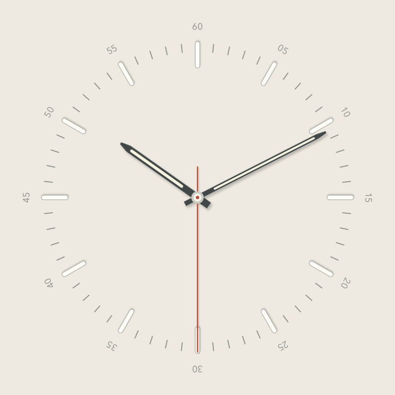
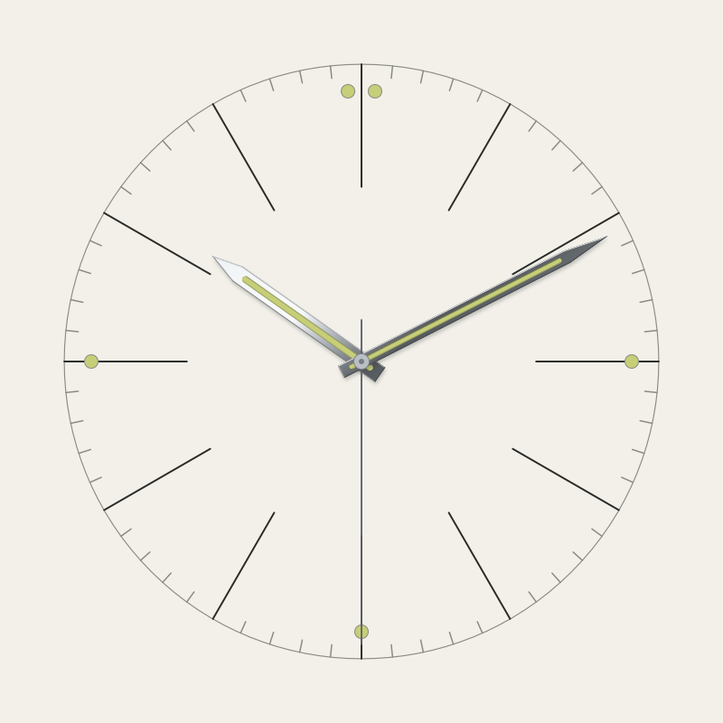
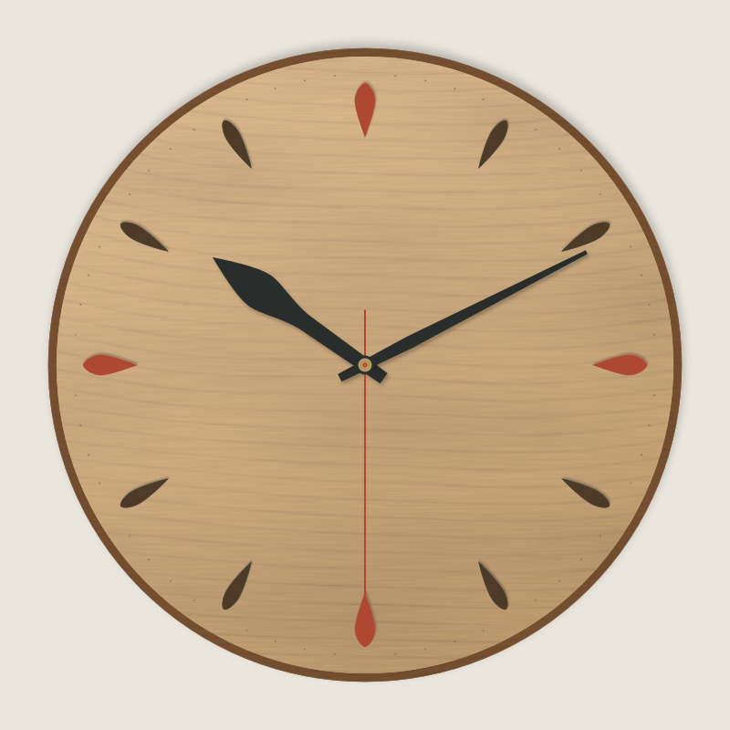
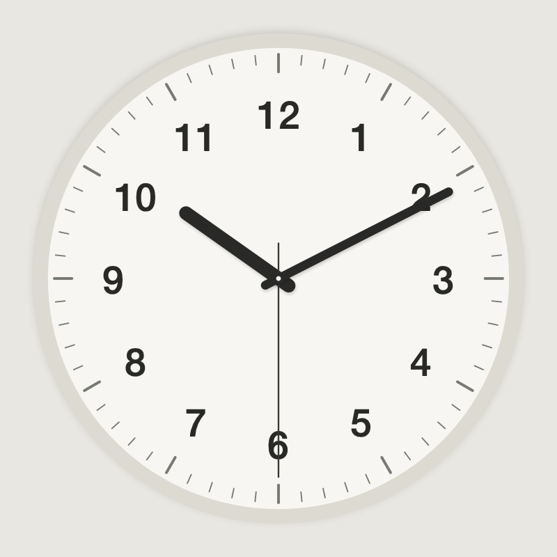
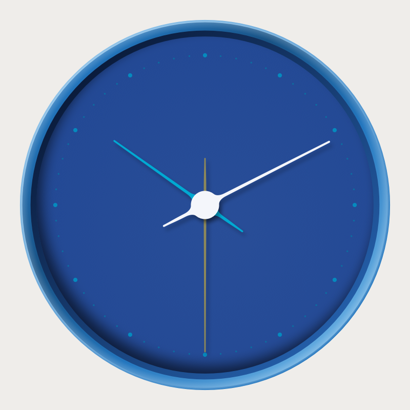
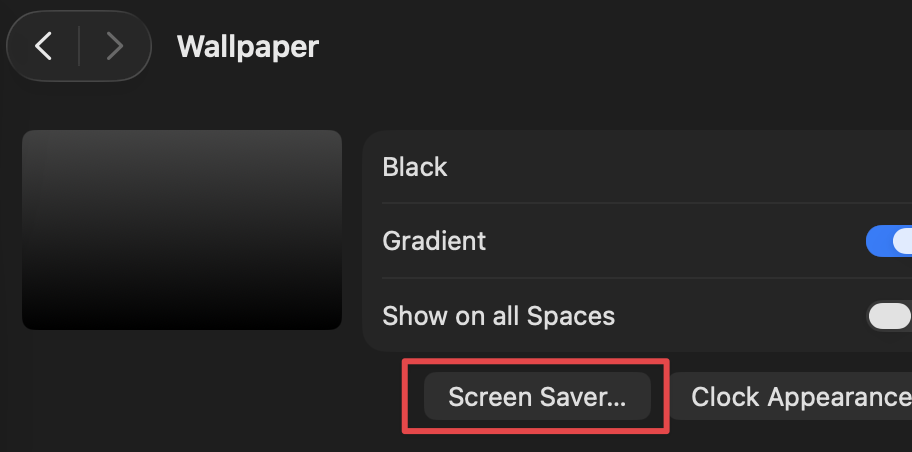
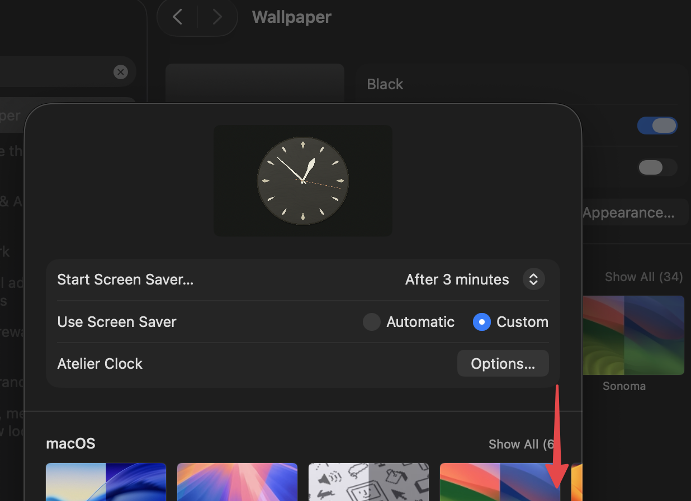
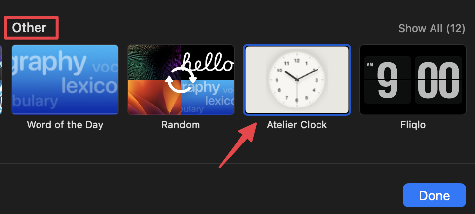
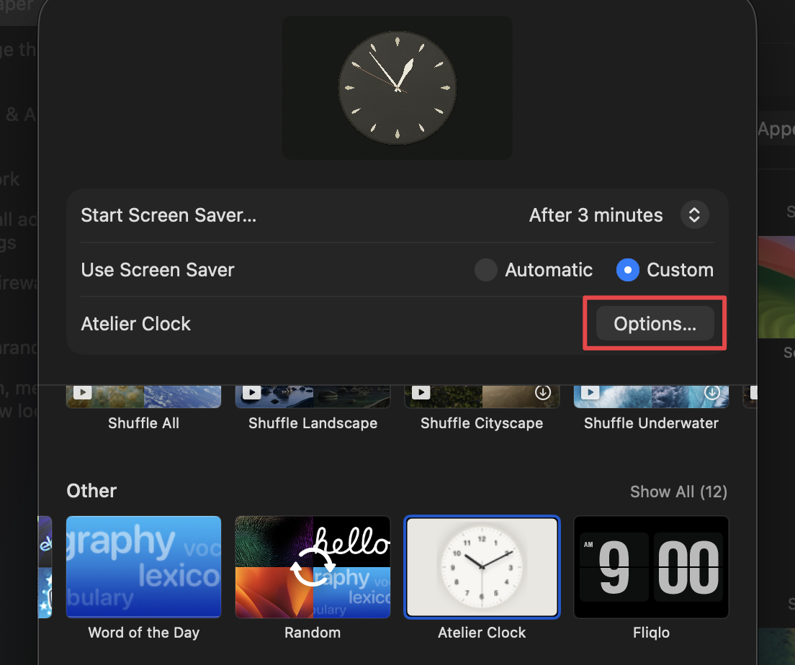

# Atelier Clock

A native macOS clock and screensaver with five analog dials, tactile materials, and quiet motion. Runs offline on macOS 13 or later, on Apple Silicon and Intel.

| Atelier | Bill | Los Angeles |
| :---: | :---: | :---: |
|  |  |  |
| **Ikko** | **Georg** | |
|  |  | |

## Build and install

Install Apple's Command Line Tools if needed:

```sh
xcode-select --install
```

Then double-click `Build-and-Install.command`, or run:

```sh
bash build.sh
open "build/Atelier Clock.saver"
```

Choose installation for your user, then on macOS 26:

1. Open **System Settings** and select **Wallpaper**.

2. Then select **Screen Saver…**



3. Select **Custom** if needed, and then scroll down to the **Other** section. 


4. Select **Atelier Clock** over on the right.


5. Use Wallpaper>**Options…** to customize it.


On earlier macOS versions, open **System Settings → Screen Saver** and select **Atelier Clock**.

When updating an existing installation, open the rebuilt `.saver` and replace the installed copy. Quit and reopen System Settings to reload the screensaver and its clock thumbnail.

To run the desktop app:

```sh
open "build/Atelier Clock.app"
```

The build creates both products in `build/` and signs them locally. It does not replace an installed copy automatically. No texture downloads or third-party packages are needed.

## Dials and options

| Dial | Character |
| --- | --- |
| Atelier | Raised markers and luminous hands |
| Bill | Fine hour lines, luminous dots, and polished silver or gold hands |
| Los Angeles | Procedural wood grain, tapered markers, and sculpted hands |
| Ikko | Clear everyday numerals and rounded hands |
| Georg | A recessed dial, dot markers, and slender hands |

Choose a palette, Light / Dark / Follow System appearance, clock size, and Smooth / Mechanical / Quartz movement. Optional hour numerals start off for new installations; Ikko's numerals are part of its dial. The clock stays centered.

**Auto · Daily**, at the bottom of the Design menu, chooses a design and palette for each local calendar day. It stays consistent across restarts and between the app and screensaver, changes at midnight, and never repeats the previous day's design.

In the desktop app, use **⌘,** for settings, **⌘F** for full screen, and **⌘Q** to quit. You can move the app to Applications. It shares preferences with the screensaver and does not prevent display sleep.

## Materials

Los Angeles generates its wood grain locally from deterministic noise and curved growth patterns, then caches it for drawing. The four finishes are Birch · Vermilion, Ash · Petrol, Walnut · Brass, and Smoked · Ivory.

## Known issue

The **Options…** button used to customize the screensaver can stop responding after System Settings has been open for a while. This remains an unresolved intermittent bug. Quit System Settings completely and reopen it to restore the button. You can also change the shared clock preferences in the desktop app with **⌘,**.

## Development

```sh
bash Tests/run.sh
bash Tests/run.sh --options
```

The second command briefly displays test windows and requires a logged-in Mac session with WindowServer access. Both commands use isolated test preferences.

See [development notes](docs/DEVELOPMENT.md) for architecture, validation, and troubleshooting. An older single-dial [browser prototype](Examples/BrowserPreview/index.html) is kept separately from the native app.

## Remove

Remove the screensaver in System Settings or delete `~/Library/Screen Savers/Atelier Clock.saver` in Finder. Remove the desktop app wherever you placed it. Your source checkout is separate from both installed products.
